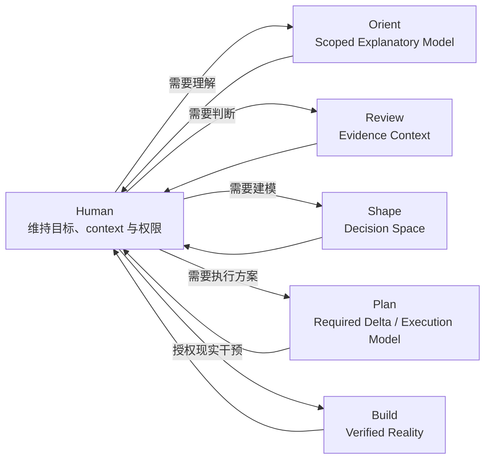
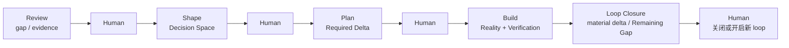

# Human ReAct Loops

Human ReAct 不是自动执行的 `review → shape → plan → build` 流水线。Human 解释每轮结果并选择下一次委托；Agent 只在当前 task 内运行 micro ReAct。

Task 行为见 [Tasks](tasks/)，共享边界见 [Core](core.md)，本文件只描述 task 之间的关系和反馈尺度。

## Macro Loop



`task → Human` 返回该主要责任下的结果及实质改写披露；`Human → task` 表示 Human 显式选择本轮协作意图。连线不是 routing、默认下一步或授权。Prompt 动作措辞在所选 task 内解释，不产生跨 task 连线。

三种循环可以嵌套：

```text
单次 task：Agent Micro ReAct
同一 task 多轮：保持所选 task，Human 补充 prompt，Agent 更新 task 内的请求解释与结果
跨 task 多轮：Human 明确重新选择 task，Agent 按新选择处理后续请求
```

Human 可以选择 Orient 作为 understanding side-loop，它不是 Review 前置阶段；Review 可直接包含必要理解模型。诊断、设计和规划也可作为当前 task 的辅助分析，不要求逐一交接。

## Commitment Flow

Shape、Plan 和 Build 常形成信息逐步收敛的方向，但不是固定顺序：

```text
Shape Candidate
→ Plan may close a means-level Resolved Choice
→ Plan may form Planned Change
→ Build request establishes Authorized Change
→ Build produces Actual Change when required
```

每个箭头都受当前 Human prompt、scope、Constraint 和 risk boundary 限制：

```text
Candidate consideration ≠ Human Decision
Resolved Choice ≠ Build Authorization
Planned Change ≠ Authorized Change ≠ Actual Change
Related to request ≠ necessary to change
No Actual Change ≠ Build failed
```

Shape 可以保持多个未关闭 Candidate。Plan 根据 Current State 判断 Required Delta；若目标已经满足，可以不生成 Change Surface。Build 根据最新 Reality 再次检查 delta，不能把 Plan 当成必须逐项执行的命令清单。

## Delivery Loop

一个常见 delivery loop 从 Review 暴露 gap 开始，经可选 Shape 和 Plan，在 Build 返回 verified reality 后结束：



Shape、Plan 和补充 Review 都可跳过或重复。Human 选择 Build 并授权明确的小修改时，可以直接 `Build → Human`，构成最小 delivery loop。Build 是当前 loop 的终点，不是项目生命周期终点；Remaining Gap 也不会自动成为新授权。

Build 对潜在耦合使用：

```text
Plan baseline
→ Semantically Atomic Intervention
→ reality feedback
→ internal Observable Boundary Gate
→ Continue, Investigate, or Handback
```

该 micro loop 只限制现实扩张。它不要求 Human 检查 dependency graph，也不声称完整发现隐藏耦合。

## Same-task Convergence

### Orient

Follow-up 默认补充或修正被追问的 explanatory model；只有总结或 material conflict 才重建整体模型。

### Review

新 evidence 可以修正 finding、gap 或 diagnosis。Review 通过证据边界收敛，不通过强制形成唯一结论收敛。

### Shape

```text
Current Take + Decision Space
+ New Human Context + System Evidence + Agent Contribution
- Rejected or invalidated content
= Model Delta
```

短轮返回 delta，只有需要 consolidated view 时重建完整 Decision Space。

### Plan

新 execution context 可以修订 Required Delta、Change Surface 或 Verification。Change Surface 一旦变化，返回完整当前修改面；这仍不产生 Build authorization。

### Build

Build 在一个 semantic intervention 后观察和验证，再决定继续、调查或 Handback。它不会自动进入 Review，也不会根据 Remaining Gap 启动下一 loop。

## Macro ReAct Mapping

```text
Observation：Orient / Review / Build 返回解释、evidence 或 Reality feedback
Reason：Human 解释结果并判断当前缺少哪种状态
Action：Human 委托一个 task；Agent 在边界内运行 micro ReAct
Handback：结果和 material boundary 返回 Human
```

这里的 Action 不一定修改现实：Orient 改变理解，Review 改变判断 context，Shape 改变 Decision Space，Plan 改变 Execution Model，只有 Build 可以对业务 target 实施 durable 或 material intervention。Human 显式选择 effectful Lens 时产生的固定 protocol sidecar 不改变这一 task 分工。

## Invariants

- 只有 Human 明确重新选择才跨 task 移动，系统不从动作措辞自动路由；
- Task 内完成必要辅助分析；实质改写在结果中披露，未执行动作不自动形成下一轮或待办；
- 完成度按解释后的请求判断，结果不自动晋升承诺或权限；
- Build verification 支持请求与 evidence 覆盖内的验收判断，不扩大为整个产品正确的保证；
- Loop closure 是当前 evidence 下的 provisional closure，可被新 evidence、Reality change 或新目标重新打开。
