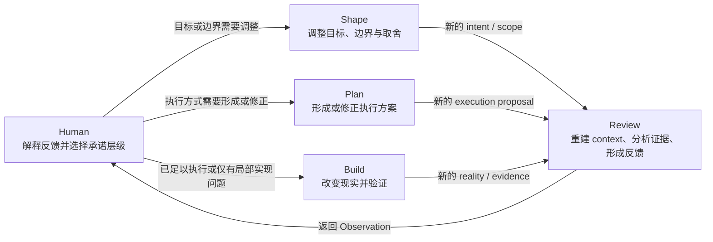
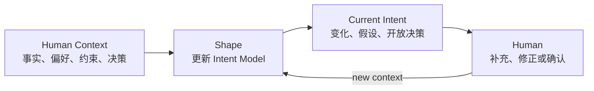
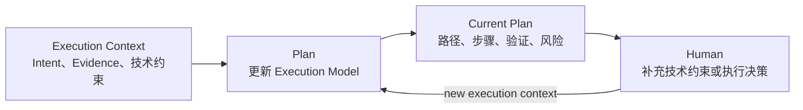
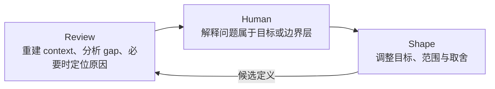
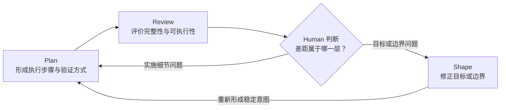
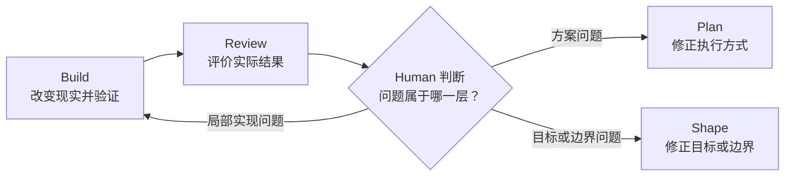
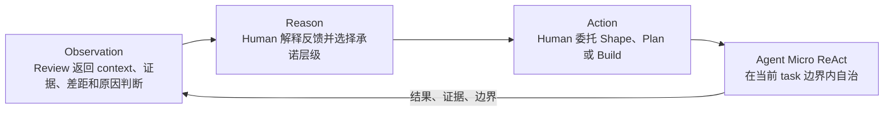
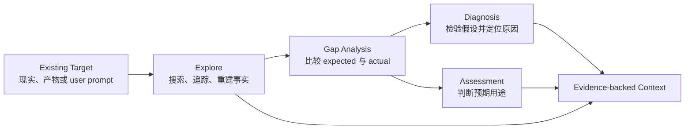

# Human ReAct 实际循环

Human ReAct 的实际运行不是 `review → shape → plan → build` 这样的固定流水线，而是一个由 Human 维持、以 `review` 为反馈中心的渐进式承诺循环。

`review` 将现实状态、已有产物和执行结果转化为可判断的 Observation。Human 根据这些反馈决定下一轮应修改目标定义、执行方案还是现实对象，并通过新的 user prompt 发起对应 task。系统不会根据图中的连线自动转换 task。

## 总体模型



图中的核心不是 task 的顺序，而是两种方向相反的信息流：

- `shape / plan / build → review`：把新产生的定义、方案或现实结果转化为证据和评价；
- `review → Human → shape / plan / build`：Human 根据差距所在的层级选择下一轮委托。

因此，Human 是宏观 loop 的控制者；task 只是每一轮的委托模式；Agent 在一个 task 内部仍可运行自己的多轮观察、推理、工具调用和验证。

Human ReAct 同时存在三种不同尺度的循环：

```text
单次 task 内部：Agent Micro ReAct
同一 task 多轮：Human 补充 context，Shape 或 Plan 更新当前模型
跨 task 多轮：Human 根据反馈在 Review、Shape、Plan、Build 之间移动
```

这些循环可以嵌套，但都不构成自动状态机。

## 渐进式承诺

三个主要 task 对应三种逐步增强的承诺：

| 层级 | Task | 被改变的状态 | 典型产物 |
| --- | --- | --- | --- |
| 意图承诺 | `shape` | 想要什么、边界在哪里、接受哪些取舍 | 稳定的目标与约束 |
| 执行承诺 | `plan` | 准备如何实现、如何验证、怎样控制风险 | 可执行方案 |
| 现实承诺 | `build` | 代码、配置、文档或其他实际对象 | 已修改并经过验证的结果 |

`review` 不增加这些承诺。它检查当前层级的对象是否足以支持预期用途，并把差距反馈给 Human。Human 可以继续提高承诺程度，也可以退回较高层重新定义问题。

## 同一 Task 的多轮收敛

### 多轮 Shape：Context Accretion



Shape 的每一轮都把新 Human context 合并进当前 intent，明确本轮改变了什么、哪些假设失效、哪些关键选择仍未解决。它不是重新生成完整需求，也不会因为缺少信息而自动续接提问。Agent 返回当前 intent 后 Handback，Human 决定是否再次选择 shape、插入 review，或进入 plan/build。

Shape 的收敛条件不是消除所有未知，而是目标、scope、关键约束和重要取舍已经足以支持预期下一步。

### 多轮 Plan：Execution Convergence



Plan 的每一轮吸收与实施相关的前序 context，保留会影响执行的目标、约束、事实、决策和假设，并解决实施策略、步骤、依赖、兼容性和验证之间的冲突。

Plan 只解决实施层冲突。如果冲突会改变目标、产品语义、scope、重要风险承诺或授权，Agent 必须 Handback；Human 可以回到 shape 或直接补充决定。Plan 的收敛条件是方案已经足以让 build 在既定边界内自主执行和验证。

## 三个局部循环

### 1. 问题定义循环：Review 与 Shape



这个循环回答：

> 我们对问题、目标和边界的理解是否已经足够稳定？

Review 可以围绕已有 target 搜索和重建必要 context，分析 gap，并在问题需要时通过假设检验定位原因。Shape 根据 review 暴露的证据调整目标、scope 或取舍。新的 shape 再次成为 review target，直到 Human 认为意图已经足够稳定。

### 2. 执行准备循环：Plan 与 Review



这个循环回答：

> 当前意图是否已经转化成足以执行和验证的方案？

当 review 发现的是步骤、依赖、验证或风险控制问题时，Human 可以再次选择 plan。当计划暴露的是目标冲突、范围不清或关键取舍时，应回到 shape，而不是继续在计划细节中修补。

### 3. 现实反馈循环：Build 与 Review



这个循环回答：

> 实际变化是否符合此前形成的承诺？

局部实现缺陷可以通过新的 build 修正；执行策略或验证方法有问题时回到 plan；如果实际结果暴露了需求、产品语义或 scope 问题，则回到 shape。Review 提供 evidence-backed context，可以包含 gap analysis 和 diagnosis，但不自动选择或执行这些后续 task。

## 与宏观 ReAct 的对应



Human 的 Action 是一次有目标和边界的委托，不一定是直接修改现实：

- 委托 `shape` 会改变共享的目标定义；
- 委托 `plan` 会改变共享的执行承诺；
- 委托 `build` 会改变实际对象；
- 后续 `review` 将这些变化重新转化为 Observation。

因此，Human ReAct 是一个以人类判断维持的宏观闭环，而不是要求系统实现自动状态机。

## Exploration、Gap Analysis 与 Diagnosis

`explore` 不再是顶层 task，而是所有 task 都可以使用的内部能力。在 review 中，Agent 可以根据 user prompt 自主组合不同的分析动作：



图中不是强制流水线。一个 review 可以只重建事实，也可以比较差距、完成 diagnosis 或评价可用性。Gap analysis 回答“哪里不同”，diagnosis 回答“为什么不同”；它们概念不同，但共同服务于形成 context，因此不要求 Human 选择不同顶层 task。

Review target 也可以是 Human 当前的 user prompt。此时 review 检查其中的事实主张、原因假设、目标、约束和执行请求，区分证据、推断与偏好，并把风险或缺失 context 交还 Human。它审计 prompt 的内容，不评价用户本人，也不把被审计的执行请求自动视为操作授权。

## 常见路径

这个操作模型可以简写为：

```text
Review
→ (Shape → Review)*
→ Plan
→ (Review → Shape/Plan)*
→ Build
→ Review
```

其中 `*` 表示 Human 可以重复发起该类委托，不表示自动循环。实际路径可以跳过任意中间 task，也可以从任意已有产物开始。例如，一个边界明确的小修改可以直接 `build → review`；一个需求不清的问题则可能长时间停留在 `review ↔ shape`。

## 不变量

- Review 是常见的反馈中心，但不是每一轮都必须显式执行的固定关卡；
- Shape、Plan 和 Build 表示不同承诺层级，不是必须依次通过的阶段；
- Human 决定跨 task 的移动，系统不自动路由；
- Agent 可以在当前 task 内吸收不改变目标与授权边界的局部前置工作；
- scope expansion、目标改变、新权限和重要取舍必须 Handback；
- Explore、gap analysis、diagnosis 和 assessment 是 task 内部分析动作，不是 Human 必须分别路由的顶层 task。
