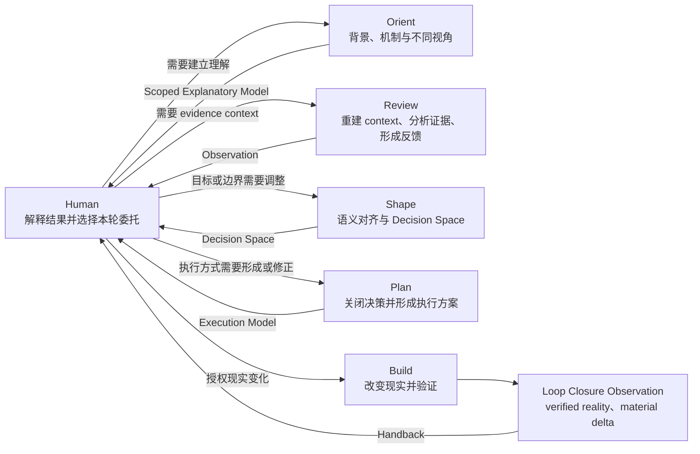
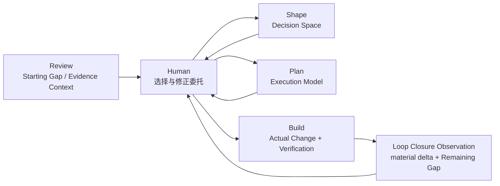
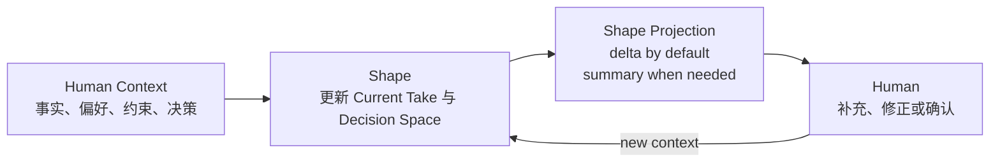
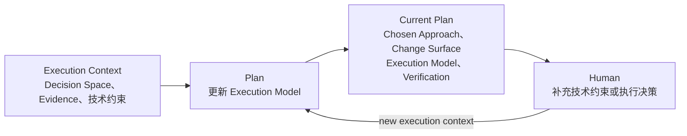
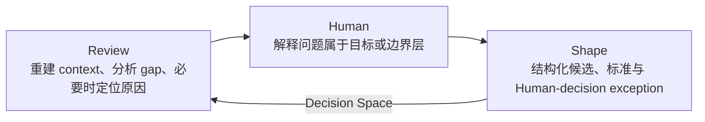
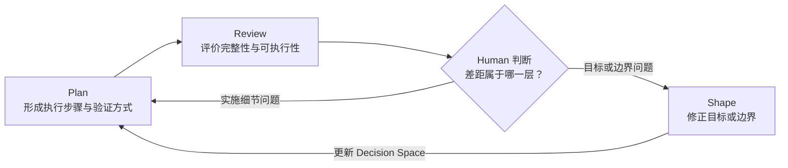
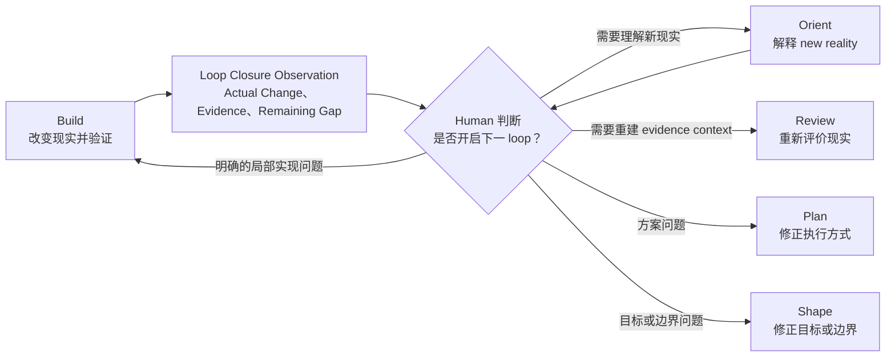
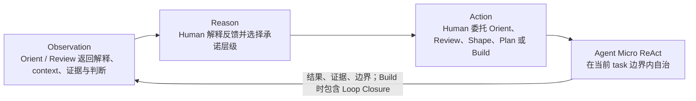

# Human ReAct 实际循环

Human ReAct 的实际运行不是自动执行的 `review → shape → plan → build` 流水线，而是由 Human 维持的一系列可关闭 delivery loop。一个常见 loop 从 Review 暴露 gap 开始，经可选 Shape / Plan 收敛，在 Build 产生 verified reality 与 Loop Closure Observation 后结束；Human 决定是否根据新现实开启下一 loop。Orient 是可在任意时点插入的 understanding side-loop，不是 Review 的前置阶段，也不参与 delivery loop 的自动流转。

本文只定义 task 之间的关系和反馈尺度；每个 task 的职责、自治与完成条件见 [Tasks README](tasks/README.md)。

`orient` 将相关背景、机制和观察角度组织为面向 Human 的 Scoped Explanatory Model；`review` 将现实状态、已有产物和执行结果转化为可判断的 Observation。Human 根据这些反馈决定当前 delivery loop 应修改目标定义、执行方案还是现实对象，并通过新的 user prompt 发起对应 task。Build 返回当前 loop 的最终 reality observation；系统不会根据图中的连线自动转换 task 或开启下一 loop。

Review 可以在有信息价值时附带少量 Follow-up Options，暴露能继续降低不确定性的探索或决策方向。这些选项是 Observation 中的行动可能性，不是系统路由、默认下一步或新授权；仍由 Human 解释、选择并发起新一轮。

## 总体模型



图中的核心不是 task 的顺序，而是两种方向相反的信息流：

- `task → Human`：每个 task 返回其维护的状态；Build 额外以 verified reality 和 material delta 关闭当前 delivery loop；
- `Human → task`：Human 根据差距所在的层级选择当前或下一 loop 的委托。

因此，Human 是宏观 loop 的控制者；task 只是每一轮的委托模式；Agent 在一个 task 内部仍可运行自己的多轮观察、推理、工具调用和验证。

Human ReAct 同时存在三种不同尺度的循环：

```text
单次 task 内部：Agent Micro ReAct
同一 task 多轮：Human 补充 context，Orient 修正 explanatory model，Shape 更新 Current Take 与 decision space，Plan 收敛 execution model
跨 task 多轮：Human 根据反馈在 Orient、Review、Shape、Plan、Build 之间移动
```

这些循环可以嵌套，但都不构成自动状态机。

## 从决策空间到现实承诺

Shape 先对齐 Human 表达与系统语义，再结构化决策空间；Plan 在 contextual delegation 内关闭 means-level decision 并形成 Planned Change；Build 只把当前 execution request 实际授权的部分变成现实。这是常见的信息精炼方向，不是必须依次通过的阶段。

| 层级 | Task | 被改变的状态 | 典型结果 |
| --- | --- | --- | --- |
| 理解支持 | `orient` | Human 对 Subject 的 working understanding | Scoped Explanatory Model |
| 决策空间 | `shape` | Human Anchor、Current Take、系统语义、可判断的 Candidate、区分标准与 Human-decision exception | 有边界的 Decision Space |
| 计划承诺 | `plan` | current delegation 内选择哪条路径、计划改哪些对象、如何实现与验证 | Chosen Approach + Planned Change Surface + Execution Model |
| 授权行动与闭合 | `build` | current Build request 覆盖的现实对象，以及本轮从 Starting Gap 到 verified reality 的 material delta | Authorized Change → Actual Change + Verification + Loop Closure Observation |

`orient` 和 `review` 都不增加这些承诺：前者提供解释，后者提供 evidence-backed judgment。Shape 也不强制关闭所有候选；Human 可以在 Shape 中作出决定，也可以显式发起 Plan，将当前 goal、scope、constraint 和 risk boundary 内未被排除的 means-level choice 委托给 Plan 关闭。

```text
Candidate consideration ≠ Human Decision
Resolved Choice ≠ Build Authorization
Planned Change ≠ Authorized Change ≠ Actual Change
```

## Delivery Loop Closure

一个 delivery loop 通常从 Review 暴露的 gap 开始，在 Human 的连续委托下经过可选 Shape、Plan 或补充 Review，并在 Build 返回 verified reality 后结束：



图中路径不是固定 stage：Shape、Plan 和补充 Review 都可以跳过或重复。Orient 可以在 Human 需要理解背景、机制或新现实的任意时点形成独立 side-loop，但不会因此成为 delivery stage。一个 scope 清晰的 direct Build 构成最小 delivery loop，它从当前 request 开始，由 Outcome、Actual Changes 和 Verification 完成闭合，不需要伪造此前阶段。

Build 是当前 delivery loop 的终点，但不是项目生命周期的终点。Loop Closure 只压缩与当前 Authorized Change 有直接因果关系的 Starting Gap、Material Shift 和 Remaining Gap；它不评价前序 task 是否正确，不自动发起 Review，也不把 Remaining Gap 变成新授权。只有 Human 能用 new reality、Remaining Gap 或新目标开启下一 loop。

## 同一 Task 的多轮收敛

### 多轮 Shape：Context Accretion



Shape 的每一轮都围绕一个 primary focus，将新 Human context、相关 system evidence、Agent 提出的少量候选或反例，以及 Human 的修正与决定合并进当前工作模型。输出默认只返回 `Current Take` 的实质修正、Decision Space delta、重要 pressure point 和 open decision，不重复完整模型。

```text
Current Take + Current Decision Space
+ New Human Context
+ System Evidence
+ Agent Modeling Contribution
+ Human Decisions / Corrections
- Invalidated Assumptions
= Updated Take + Decision Space Delta
```

如果 Human 的术语与当前系统概念可能不一致，Shape 先形成可修正的 `Current Take`，而不是直接把用户用词固化为系统事实。存在重构或实质歧义时，`Human Anchor` 用于保留不应被 Agent 静默替换的核心结果。

Human 的探索性表达和 Agent contribution 不会因为被讨论过就自动成为 Decision。尚未证实的 fact 保持为 Assumption 或 Unknown，方向性推演保持为 Conditional，只有可整体接受、拒绝或比较的 proposal 才形成 Candidate。同一方案的组成部分合并表达，重要候选关系保持可见。Candidate 集合默认是当前有用但非穷尽的 working set；未被 Rejected 或 Deferred 的普通 means-level Candidate 可以在 Human 显式发起 Plan 后被考虑。只有会改变 goal、value、scope、contract、risk 或 authority 的例外才要求 Human 决定。只有 Human 要求总结、对话已经很长、重要旧表述相互冲突，或高风险 Build 需要再次确认时，才生成 consolidated decision space。

Shape 的完成条件不是消除所有候选，而是当前 focus、边界、区分标准和 `Human Decision Required` 的例外已经足够清晰。每轮结果仍然 Handback，由 Human 决定继续 shape、插入 review，或发起 plan/build。

### 多轮 Plan：Execution Convergence



Plan 的每一轮吸收与执行相关的 context 和 decision space，从当前 Plan request 重新建立 delegation。Human 显式发起 Plan 后，Agent 可以在已确认 goal、scope、constraint 和 risk boundary 内选择 Chosen Approach，用 Resolved Choice 关闭未被排除的 means-level choice，并以 Change Surface 让 Human 检查 Planned Change。

Plan 负责 decision closure，但不从 Shape 继承 authorization。如果选择会改变目标、Human value、领域规则、产品语义、scope、external contract、重要风险承诺或权限，Agent 必须 Handback；Plan 不能用实现便利把 `Human Decision Required` 伪装成技术决定。每个 Change Surface target 还必须能追溯到当前请求或不可缺少的最小附带修改。其收敛条件是 Change Surface、Execution Model、Scope 与 Verification 一致；这只形成 Planned Change，不构成 Build Authorization。

Compatibility 使用 exception-based 流转：Shape 只在 material Surface 存在时暴露 Boundary 与 Basis；这不会自动创建 Plan obligation、Planned Change 或 Build authorization。Plan 默认不为未知消费者增加兼容工作，但若 Planned Change 明显跨越已知 external contract 且 Boundary 尚未建立，也不能把缺少 preserve Constraint 当作 breaking authorization。Boundary 建立后，Plan 才在 current delegation 内关闭 Compatibility Mechanism，并把相应检查纳入 Verification。

Human 后续明确发起 Build 时，当前 execution request 明确引用或在上下文中无歧义延续的 Plan 部分，才在当前 scope、permission 和 risk boundary 内成为 Authorized Change。当前 prompt 的缩小、排除或修正优先；发起 Build 不表示 Human 认可 Plan 的全部事实判断或理由。

## 三个局部循环

### 1. 问题定义循环：Review 与 Shape



这个循环回答：

> 我们对问题、目标和边界的理解是否已经足够稳定？

Review 可以围绕已有 target 搜索和重建必要 context，分析 gap，并在问题需要时通过假设检验定位原因。Shape 根据 review 暴露的证据更新问题定义、候选、区分标准或 Human-decision exception。新的 decision space 可以再次成为 review target，但不要求 Shape 先关闭所有选择。

### 2. 执行准备循环：Plan 与 Review



这个循环回答：

> 当前意图是否已经转化成足以执行和验证的方案？

当 review 发现的是步骤、依赖、验证或风险控制问题时，Human 可以再次选择 plan。当计划暴露的是目标冲突、范围不清或关键取舍时，应回到 shape，而不是继续在计划细节中修补。

### 3. 现实反馈循环：Build Closure 与下一 Loop



这个循环回答：

> 当前 delivery loop 实际改变了什么，证据支持什么，还剩哪些 gap？

Build 以 Actual Change、Verification 和必要的 material state delta 结束当前 loop。Human 可以关闭当前目标，也可以根据 Remaining Gap 或 new reality 发起新的 Orient、Review、Shape、Plan 或 Build。Orient 可以帮助理解新出现的机制或背景，但不判断缺陷；局部实现缺陷可以通过新的 Build loop 修正；执行策略或验证方法有问题时可以选择 Plan；如果实际结果暴露需求、产品语义或 scope 问题，可以选择 Shape。Review 提供 evidence-backed context，可以包含 gap analysis 和 diagnosis，但这些路径都不会被 Build 自动启动。

## 与宏观 ReAct 的对应



Human 的 Action 是一次有目标和边界的委托，不一定是直接修改现实：

- 委托 `orient` 会改变 Human 的 working understanding，但不产生 verdict、commitment 或 reality change；
- 委托 `review` 会形成 evidence-backed judgment，但不增加现实行动授权；
- 委托 `shape` 会改变共享的目标定义；
- 委托 `plan` 会改变共享的执行承诺；
- 委托 `build` 会改变实际对象；
- `build` 自身通过 Verification 与 Loop Closure Observation 返回新的现实状态；Human 决定是否再用 `review` 重建更完整的 Evidence Context。

因此，Human ReAct 是一个以人类判断维持的宏观闭环，而不是要求系统实现自动状态机。

## 常见路径

这个操作模型可以简写为：

```text
Human ↔ Orient

Review
→ (Shape → Review)*
→ Plan
→ (Review → Shape/Plan)*
→ Build
→ Loop Closure Observation
→ Human
→ [optional new Orient / Review / Shape / Plan / Build loop]
```

其中 `*` 表示 Human 可以重复发起该类委托，不表示自动循环。`Human ↔ Orient` 表示 understanding side-loop 可以在任何时点发生，而不是固定的第一步。实际路径可以跳过任意中间 task，也可以从任意已有产物开始。例如，一个边界明确的小修改可以直接 `build → Loop Closure Observation → Human`；一个需求不清的问题则可能长时间停留在 `review ↔ shape`。新 loop 是否开始始终由 Human 决定。

## 不变量

- Review 是常见的反馈中心，但不是每一轮都必须显式执行的固定关卡；
- Orient 改善 Human understanding，但不产生 judgment、commitment、authorization 或 reality change；
- Shape 结构化 decision space，Plan 在授权内收敛执行路径，Build 产生现实效果；它们不是必须依次通过的阶段；
- Human 决定跨 task 的移动，系统不自动路由或自动续接。

task 内自治和 Handback 边界由 [Tasks README](tasks/README.md) 定义。
